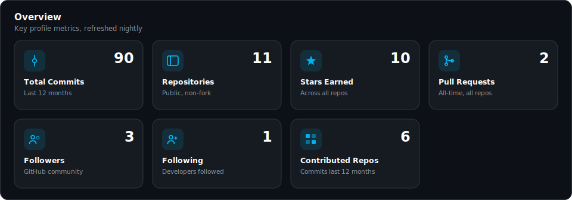
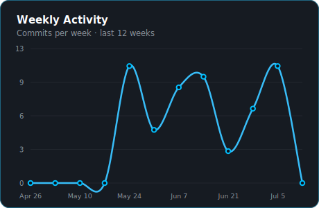
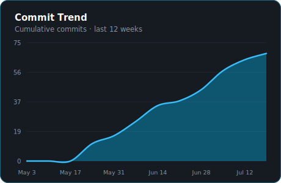
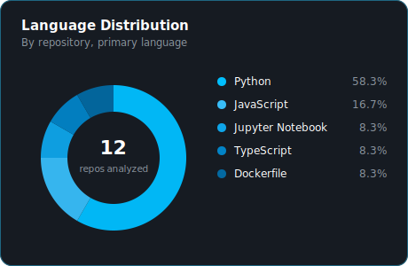
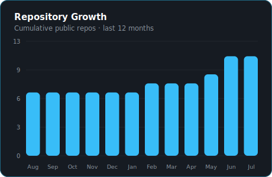
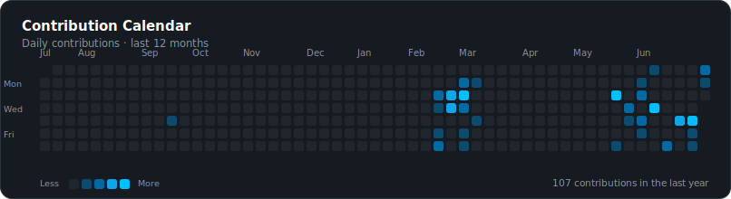

<div align="center">

<h1>Hey, I'm Anas Hasan 👋</h1>

<p><b>AI/ML Engineer &nbsp;·&nbsp; Building Agentic Systems with LangGraph &amp; RAG &nbsp;·&nbsp; B.E. CSE (AI/ML) &rsquo;25</b></p>

[](https://git.io/typing-svg)

<br/>

[](https://www.linkedin.com/in/anas-hasan-a5546524b/)
[](https://leetcode.com/u/AnasHasan786/)
[](mailto:anas.hassan9417@gmail.com)
[](https://medium.com/@anas.hassan9417)

</div>


## About Me

I'm an AI/ML Engineer focused on agentic systems — multi-agent pipelines, RAG, and the infrastructure around them.

I graduated in 2025 and have hands-on industry experience with FastAPI services, Amazon Bedrock, and AWS infrastructure (ECS, ECR, SQS). Since then, I've been building projects end-to-end and contributing to open source to sharpen my ability to write production-grade code, not just prototypes.

What I care about most is the part of AI systems that's easy to skip in a demo — error handling, retries, evaluation, and making sure an agent fails safely instead of confidently making things up.


## Technical Stack

**Agentic AI & LLM Systems**


**Languages & ML Frameworks**


**Backend & Infrastructure**


## Featured Projects

### 🔮 deepscholar-ai — Autonomous Multi-Agent Research Pipeline

> Stateful, graph-driven scientific paper exploration with cross-document validation — built strictly against hallucination.

```
PDF Corpus ──▶ FAISS Vector Store ──▶ LangGraph Execution Graph
                                              │
                                    ┌─────────▼─────────┐
                                    │   Research Agent  │
                                    └─────────┬─────────┘
                                              │
                                    ┌─────────▼─────────┐
                                    │   Critic Agent    │──── REJECT ──┐
                                    └─────────┬─────────┘              │
                                         ACCEPT                        │
                                    ┌─────────▼─────────┐              │
                                    │  Improver Agent   │◀─────────────┘
                                    └─────────┬─────────┘
                                              │
                                    ┌─────────▼─────────┐
                                    │  Streamlit UI     │
                                    └───────────────────┘
```

**Key architecture:** LangGraph multi-agent cycle with Research → Critic → Improver nodes. Critic node rejects and re-routes suboptimal outputs automatically. Local FAISS vector store for document grounding, with Groq-hosted Llama models for generation. Streamlit frontend for interactive paper querying and result exploration. Containerized with Docker and deployed on AWS.


&nbsp;&nbsp;**[→ View Repository](https://github.com/AnasHasan786/deepscholar-ai)**


### 🤖 traceagent — AI Debugging & Incident Diagnosis Tool

> Ingests stack traces and telemetry, routes them through an async pipeline, and produces a root-cause analysis with a dashboard to review it.

```
Raw Stack Trace / Telemetry Data
              │
              ▼
┌─────────────────────────────┐
│     FastAPI Ingest API      │  ◀── POST /api/v1/incidents
└──────────────┬──────────────┘
               │
               ▼
┌─────────────────────────────┐
│       AWS SQS Queue         │  ◀── Async Buffer
└──────────────┬──────────────┘
               │
               ▼
┌─────────────────────────────┐
│    Incident Worker Loop     │
└──────────────┬──────────────┘
               │
               ▼
┌─────────────────────────────┐
│   n8n Auth & Orchestration  │  ◀── Workflow Automation
└──────────────┬──────────────┘
               │
               ▼
┌─────────────────────────────┐
│      Analyzer Service       │  ◀── Root Cause + Action Plan
└──────────────┬──────────────┘
               │
               ▼
┌─────────────────────────────┐
│     MongoDB  ·  Next.js     │  ◀── Incident Dashboard & Logs UI
└─────────────────────────────┘
```

**Key architecture:** FastAPI ingest API buffers incoming incidents through AWS SQS, with n8n handling auth and workflow orchestration between services. Every LLM decision and intermediate state is logged so you can trace how a root-cause conclusion was reached. Next.js dashboard surfaces incident timelines and reports in real time. Deployed on AWS EC2.


&nbsp;&nbsp;**[→ View Repository](https://github.com/AnasHasan786/traceagent)**


## Engineering Philosophy

```python
class AnasHasan:

    degree      = "B.E. CSE — Artificial Intelligence & Machine Learning (2025)"
    focus_areas = ["Multi-Agent Systems (LangGraph)", "RAG Pipelines",
                    "FastAPI Backends", "AWS Infrastructure"]

    def build(self, problem):
        # Understand the failure modes before the happy path
        identify_edge_cases(problem)
        design_feedback_loops(problem)
        write_tests(problem)
        return ship_it(problem)
```


## GitHub Analytics Dashboard

<div align="center">



<br/>

<sub>⚡ Live · Auto Updated Nightly via GitHub Actions</sub>

<br/>




<br/>




<br/>



<br/>

<sub>Generated locally with Python · No third-party stat cards · Refreshes every night at 00:00 UTC</sub>

</div>


## Currently

- 🔬 &nbsp; Contributing to open source projects and writing more code independently, less AI-assisted
- 🧠 &nbsp; Practicing DSA (NeetCode 150 in C++) for interviews
- 🤝 &nbsp; Open to full-time AI Engineer, Backend Engineer, and Software Engineer roles


<div align="center">

[](https://git.io/typing-svg)

</div>
